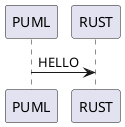

# plantuml_encoding

[![ga-svg]][ga-url]
[![crates-svg]][crates-url]
[![docs-svg]][docs-url]
[![codecov-svg]][codecov-url]
[![deps-svg]][deps-url]

[ga-svg]: https://github.com/maksugr/plantuml_encoding/workflows/build/badge.svg
[ga-url]: https://github.com/maksugr/plantuml_encoding/actions
[crates-svg]: https://img.shields.io/crates/v/plantuml_encoding.svg
[crates-url]: https://crates.io/crates/plantuml_encoding
[docs-svg]: https://docs.rs/plantuml_encoding/badge.svg
[docs-url]: https://docs.rs/plantuml_encoding
[codecov-svg]: https://img.shields.io/codecov/c/github/maksugr/plantuml_encoding
[codecov-url]: https://codecov.io/gh/maksugr/plantuml_encoding
[deps-svg]: https://deps.rs/repo/github/maksugr/plantuml_encoding/status.svg
[deps-url]: https://deps.rs/repo/github/maksugr/plantuml_encoding

Encoding and decoding text plantuml diagrams to facilitate communication of them through URL.

## Overview

Consider the next plain text plantuml diagram:



It can be encoded to `0IO0sVz0StHXSdHrRMmAK5LDJ20jFY1ILLDKEY18HKnCJo0AG6LkP7LjR000` and with the help of the plantuml server (`https://www.plantuml.com/plantuml/uml/`) it can be shared [through URL](https://www.plantuml.com/plantuml/uml/0IO0sVz0StHXSdHrRMmAK5LDJ20jFY1ILLDKEY18HKnCJo0AG6LkP7LjR000).

Also, it can be decoded in the opposite direction.

Plantuml [declares support](https://plantuml.com/text-encoding) for the following compression algorithms:

* [deflate](https://en.wikipedia.org/wiki/Deflate)
* [brotli](https://en.wikipedia.org/wiki/Brotli)
* [hex](https://en.wikipedia.org/wiki/Hexadecimal)

But in fact, plantuml supports only `deflate` and `hex` ([`brotli` is turned off](https://forum.plantuml.net/15341/encoding-does-brotli-not-work-anymore-programatically-curl?show=15349)). So the crate supports only `deflate` and `hex` too.

## Installation

In order to use this crate, you have to add it under `[dependencies]` to your `Cargo.toml`:

```toml
[dependencies]
plantuml_encoding = "0.1.0"
```
