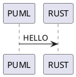

# plantuml_encoding

[![build-svg]][build-url]
[![test-svg]][test-url]
[![codecov-svg]][codecov-url]
[![crates-svg]][crates-url]
[![docs-svg]][docs-url]
[![deps-svg]][deps-url]

[build-svg]: https://github.com/maksugr/plantuml_encoding/workflows/build/badge.svg
[build-url]: https://github.com/maksugr/plantuml_encoding/actions/workflows/build.yml
[test-svg]: https://github.com/maksugr/plantuml_encoding/workflows/test/badge.svg
[test-url]: https://github.com/maksugr/plantuml_encoding/actions/workflows/test.yml
[codecov-svg]: https://img.shields.io/codecov/c/github/maksugr/plantuml_encoding
[codecov-url]: https://codecov.io/gh/maksugr/plantuml_encoding
[crates-svg]: https://img.shields.io/crates/v/plantuml_encoding.svg
[crates-url]: https://crates.io/crates/plantuml_encoding
[docs-svg]: https://docs.rs/plantuml_encoding/badge.svg
[docs-url]: https://docs.rs/plantuml_encoding
[deps-svg]: https://deps.rs/repo/github/maksugr/plantuml_encoding/status.svg
[deps-url]: https://deps.rs/repo/github/maksugr/plantuml_encoding

Encoding and decoding text plantuml diagrams to facilitate communication of them through URL.

## Overview

Consider the next plain text plantuml diagram:



It can be encoded to `0IO0sVz0StHXSdHrRMmAK5LDJ20jFY1ILLDKEY18HKnCJo0AG6LkP7LjR000` and with the help of the plantuml server (`https://www.plantuml.com/plantuml/uml/`) it can be shared [through URL](https://www.plantuml.com/plantuml/uml/0IO0sVz0StHXSdHrRMmAK5LDJ20jFY1ILLDKEY18HKnCJo0AG6LkP7LjR000).

Also, it can be decoded in the opposite direction.

Plantuml [declares support](https://plantuml.com/text-encoding) for the following compression algorithms:

* [deflate](https://en.wikipedia.org/wiki/Deflate)
* [brotli](https://en.wikipedia.org/wiki/Brotli)
* [hex](https://en.wikipedia.org/wiki/Hexadecimal)

But in fact, plantuml supports only `deflate` (with [additional transformations close to base64](https://plantuml.com/text-encoding)) and `hex` (with [additional prefix `~h`](https://plantuml.com/text-encoding)). [`brotli` is turned off](https://forum.plantuml.net/15341/encoding-does-brotli-not-work-anymore-programatically-curl?show=15349). So the crate supports only `deflate` and `hex` too.

## Installation

In order to use this crate, you have to add it under `[dependencies]` to your `Cargo.toml`:

```toml
[dependencies]
plantuml_encoding = "2.0.3"
```

## Article

There is an [article](https://maksugr.com/posts/plantuml-encoding-in-rust-using-tdd) very close describing the library under the hood.

## Examples

```rust
use plantuml_encoding::{
    decode_plantuml_deflate, decode_plantuml_hex,
    encode_plantuml_deflate, encode_plantuml_hex,
    FromPlantumlError,
};

fn main() -> Result<(), FromPlantumlError> {
    // original puml
    println!("--- Original puml ---");

    let puml = "@startuml\nPUML -> RUST\n@enduml";

    println!("Original puml:\n{}\n", puml);

    // deflate
    println!("--- Deflate ---");

    let encoded_deflate = encode_plantuml_deflate(puml)?;
    let decoded_deflate = decode_plantuml_deflate(&encoded_deflate)?;

    println!("Encoded deflate: {}", encoded_deflate);
    println!("Decoded deflate:\n{}\n", decoded_deflate);

    // hex
    println!("--- Hex ---");

    let encoded_hex = encode_plantuml_hex(puml)?;
    let decoded_hex = decode_plantuml_hex(&encoded_hex)?;

    println!("Encoded hex: {}", encoded_hex);
    println!("Decoded hex:\n{}\n", decoded_hex);

    // deflate errors
    println!("--- Deflate errors ---");

    let empty_encoded_deflate = "";

    let decoded_deflate = decode_plantuml_deflate(empty_encoded_deflate)
        .unwrap_or_else(|_| "It's not decoded deflate".to_string());

    println!("Decoded deflate error:\n{}\n", decoded_deflate);

    let decoded_deflate = match decode_plantuml_deflate(empty_encoded_deflate) {
        Ok(plantuml) => plantuml,
        Err(FromPlantumlError(err)) => {
            eprintln!("Decoded deflate error: {:?}", err);
            String::from("Result from deflate error")
        }
    };

    println!("Match decoded deflate error result:\n{}\n", decoded_deflate);

    // hex errors
    println!("--- Hex errors ---");

    let decoded_hex = match decode_plantuml_hex("12345") {
        Ok(plantuml) => plantuml,
        Err(FromPlantumlError(err)) => {
            eprintln!("Decoded hex error: {:?}", err);
            String::from("Result from hex error")
        }
    };

    println!("Match decoded hex error result:\n{}", decoded_hex);

    Ok(())
}
```

And console output after `cargo run` for these examples:

```console
--- Original puml ---
Original puml:
@startuml
PUML -> RUST
@enduml

--- Deflate ---
Encoded deflate: SoWkIImgAStDuGe8zVLHqBLJ20eD3k5oICrB0Ge20000
Decoded deflate:
@startuml
PUML -> RUST
@enduml

--- Hex ---
Encoded hex: ~h407374617274756d6c0a50554d4c202d3e20525553540a40656e64756d6c
Decoded hex:
@startuml
PUML -> RUST
@enduml

--- Deflate errors ---
Decoded deflate error:
It's not decoded deflate

Decoded deflate error: "there is a problem during deflate decoding: `deflate decompression error`"
Match decoded deflate error result:
Result from deflate error

--- Hex errors ---
Decoded hex error: "there is a problem during hex decoding: `Odd number of digits`"
Match decoded hex error result:
Result from hex error
```

Also, you can consider tests inside the files.
